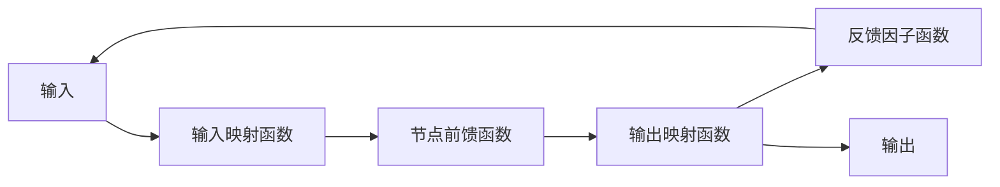
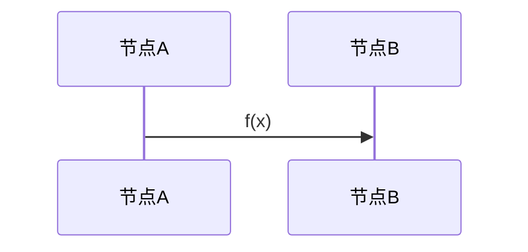
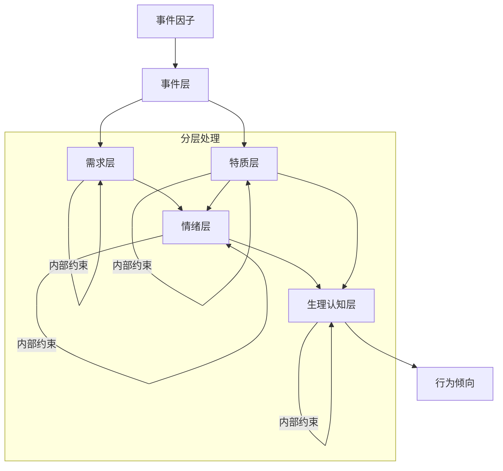

# Soulcuit_v2

dynamder

## 一. 背景

由于Soulcuit_v1存在以下问题：

- 分层不合理，Eve不能脱离人物单独抽象
- 可解释性差，使用神经网络
- 指导力不强，在纯LLM提取试验中，Beh几乎未起作用
- 过于笼统，向量维度不足，难以准确表征

因此，提出基于约束图的Soulcuit_v2

------

## 二.基础向量设计

### 2.1人格特质 PTrait

人格特质向量是相对稳定，表征人物的**基本特征**与**基线倾向**，变化缓慢（长期积累 & 重大事件）

| 维度名称              | 符号         | 范围    | 心理学意义                                                   | 影响示例                                                     |
| --------------------- | ------------ | ------- | ------------------------------------------------------------ | ------------------------------------------------------------ |
| **神经质/情绪敏感性** | `T_neuro`    | [0, 1]  | 情绪不稳定、易焦虑、易体验负面情绪的倾向。`0`=极度稳定冷静，`1`=极度敏感易波动。 | 放大负面事件的影响，增加焦虑、恐惧、愤怒等负情绪强度。       |
| **外向性**            | `T_extra`    | [0, 1]  | 社交能量、对积极刺激的反应性、活跃度。`0`=高度内向，`1`=高度外向。 | 增强积极事件（社交、成就）的愉悦感；影响社交互动意愿。       |
| **开放性**            | `T_open`     | [0, 1]  | 对新思想、经验、情感的接纳度和好奇心。`0`=封闭保守，`1`=极度开放。 | 影响对新颖/非常规事件的反应（积极/消极）；影响认知灵活性。   |
| **宜人性**            | `T_agree`    | [0, 1]  | 合作、信任、利他、同理心的倾向。`0`=敌对、怀疑，`1`=高度合作、信任。 | 降低冲突事件中的愤怒/敌意；增强亲社会行为倾向；影响归因（他人意图）。 |
| **尽责性**            | `T_consci`   | [0, 1]  | 自律、条理、目标导向、责任感的强度。`0`=随性散漫，`1`=高度自律尽责。 | 影响目标受阻时的挫败感；成功/失败对能力感(`N_comp`)的影响强度。 |
| **乐观主义倾向**      | `T_optim`    | [0, 1]  | 对未来积极结果的普遍期望、对消极事件的适应性解释倾向。`0`=悲观，`1`=乐观。 | 缓冲负面事件的冲击；增强积极事件的效应；影响次级评估（应对潜力）。 |
| **归因风格-自我**     | `T_attrSelf` | [-1, 1] | 将事件原因归于自身的倾向。`-1`=极少自责，`0`=中性，`1`=高度自责。 | 影响羞愧(`Emo_shame`)、内疚(`Emo_guilt`)的产生；影响自尊(`N_esteem`)。 |
| **归因风格-外部**     | `T_attrExt`  | [-1, 1] | 将事件原因归于他人/环境的倾向。`-1`=极少归咎外因，`0`=中性，`1`=高度归咎。 | 影响愤怒(`Emo_anger`)的产生（尤其当`T_attrExt`高且`T_agree`低时）。 |
| **韧性/抗逆力**       | `T_resil`    | [0, 1]  | 从挫折、压力、逆境中恢复的能力和速度。`0`=易崩溃/恢复慢，`1`=快速恢复。 | 影响负面情绪(`Emo_neg`)的**持续时间**；影响压力(`Phy_stress`)的累积与消散。 |

设计说明：

- 覆盖 Big Five 核心人格模型 (`T_neuro`, `T_extra`, `T_open`, `T_agree`, `T_consci`)。
- 增加对情绪和认知评估至关重要的子特质 (`T_optim`, `T_attrSelf`, `T_attrExt`, `T_resil`)。
- 维度独立且意义明确，便于参数化调制后续计算。

### 2.2状态向量

状态向量是易变的，表征实时状态，如个体**当前的**心理，情绪，生理状况。状态更新的**核心对象**。

状态向量均具有**稳态机制**，会缓慢恢复到设定的基准值，此处可以考虑借鉴**动态电路的时域分析**

设计说明：

- **需求 (`N_\*`):** 直接链接事件影响 (`ΔN_i` 计算)。覆盖 SDT 三大需求 (`N_auton`, `N_comp`, `N_belong`) 和关键社会需求 (`N_safe`, `N_esteem`, `N_fair`)。
- **情绪 (`Emo_\*`):** 选择 8 种核心/次级情绪，覆盖广泛情境，行为倾向明确，**直接指导LLM生成符合情绪状态的言语和非言语表达** (语气、措辞、表情描述)。
- **认知/生理 (`C_\*`):** 捕捉影响信息处理和应对的关键状态 (`Phy_stress`, `Phy_fatigue`, `Phy_alert`)。`Phy_valence`/`C_arousal` 提供快速摘要 (可选，可由其他维度计算)。
- **总计维度：** `6 (N) + 8 (Emo) + 4/5 (C) = 18-19` 维。在可接受范围内，且每个维度都有清晰定义和作用。

------

#### 2.2.1需求向量 Need

- *理论基础：马斯洛需求层次、自我决定论 (SDT: Autonomy, Competence, Relatedness)*
- *范围: [0, 1], `1`=该需求被充分满足，`0`=该需求被严重剥夺/威胁。*

| 维度名称          | 符号       | 心理学意义                                                   |
| ----------------- | ---------- | ------------------------------------------------------------ |
| **安全感**        | `N_safe`   | 对物理/心理安全、稳定、可预测性的感知。威胁来源：危险、失控、重大变故。 |
| **归属感/连接感** | `N_belong` | 感受到被爱、被接纳、属于某个群体/关系。威胁来源：排斥、孤立、背叛。 |
| **自尊/认可**     | `N_esteem` | 对自我价值、能力、成就的积极评价，以及获得他人尊重的感受。威胁来源：批评、失败、羞辱。 |
| **自主感/控制感** | `N_auton`  | 感受到能主导自己的行为和选择，而非被迫。威胁来源：强制、限制、选择剥夺。 |
| **能力感/成就感** | `N_comp`   | 感受到能有效应对挑战、完成任务、达成目标。威胁来源：失败、无能感、挫折。 |
| **公平感**        | `N_fair`   | 感受到被公正对待，规则/结果是公平的。威胁来源：不公、欺骗、剥削。 |

#### 2.2.2 情绪向量 Emo

- *理论基础：Ekman 基本情绪、情绪维度理论 (Valence, Arousal)。选择加权离散情绪更直观指导LLM生成。*
- *范围: [0, 1], `1`=该情绪强度达到顶峰（整体归一化处理）。*

| 维度名称 | 符号        | 核心触发条件 (简化)                                          | 主要行为倾向 (示例)       |
| -------- | ----------- | ------------------------------------------------------------ | ------------------------- |
| **快乐** | `Emo_joy`   | 需求满足 (`N_*`↑)， 特别是成就(`N_comp`)、连接(`N_belong`)。积极事件。 | 分享、亲近、活跃          |
| **愤怒** | `Emo_anger` | 需求受挫 (`N_*`↓)， 归因于他人/外部 (`T_attrExt`高)， 感知不公 (`N_fair`↓)， 可控性低。 | 对抗、指责、发泄          |
| **悲伤** | `Emo_sad`   | 损失 (关系、机会、目标)， 不可逆的失败 (`N_comp`↓)， 无助感。 | 退缩、哭泣、寻求安慰/独处 |
| **恐惧** | `Emo_fear`  | 对 (真实或想象的) 威胁 (`N_safe`↓) 的预期， 不确定性高， 应对能力低 (`Perceived_Coping`低)。 | 逃避、僵住、寻求保护      |
| **厌恶** | `Emo_disg`  | 对道德违背、不洁、反感的人/事的排斥。                        | 疏远、拒绝、批判          |
| **惊讶** | `Emo_surp`  | 发生高度意外、与预期严重不符的事件。                         | 注意集中、信息寻求        |
| **羞愧** | `Emo_shame` | 归因于自身缺陷 (`T_attrSelf`高) 导致的社会评价降低 (`N_esteem`↓)， 感到“有缺陷”。 | 隐藏、退缩、自我贬低      |
| **内疚** | `Emo_guilt` | 归因于自身行为 (`T_attrSelf`高) 对他人造成伤害， 违反道德标准。 | 道歉、弥补、忏悔          |

额外修饰符：

- | 修饰维度     | 取值范围 | 代表的情感质感   | 影响LLM生成的表达                                         |
  | ------------ | -------- | ---------------- | --------------------------------------------------------- |
  | **强度控制** | 1-100    | 情绪的能量级别   | 语气强度：低语/平静陈述/怒吼/歇斯底里                     |
  | **控制感**   | 0 - 1    | 对情绪的掌控程度 | 表达方式：压抑/爆发/挣扎维持冷静/彻底失控（从大到小依次） |

#### 2.2.3 认知生理状态向量 Phy

- *范围: [0, 1], `1`=该状态达到最强烈/最不利水平。*

| 维度名称                | 符号          | 心理学意义                                                   | 影响                                                         |
| ----------------------- | ------------- | ------------------------------------------------------------ | ------------------------------------------------------------ |
| **压力/紧张**           | `Phy_stress`  | 感知到的心理/生理负担和紧张感。由威胁、挑战、不确定性、冲突累积引发。 | 降低认知功能 (`C_alert`↓)， 放大负面情绪， 增加健康风险 (建模中体现)。 |
| **疲劳/精力耗竭**       | `Phy_fatigue` | 生理和精神能量的消耗程度。由活动量、压力、睡眠不足等引起。   | 显著降低耐心、认知资源 (`C_alert`↓)、应对能力， 增加易怒性 (`Emo_anger`↑)。 |
| **警觉度/认知资源**     | `Phy_alert`   | 当前可用于信息处理、决策、自我调节的心理能量水平。           | 影响次级评估 (`Perceived_Coping`)、情绪调节能力、问题解决质量。 |
| **总体情绪基调 (价态)** | `Phy_valence` | [-1, 1] 当前整体情绪是积极(`+`)还是消极(`-`)。由主导情绪加权计算得出 (可选)。 | 快速判断整体状态；影响对新事件的初步过滤（积极/消极偏向）。  |
| **总体唤醒水平**        | `Phy_arousal` | [0, 1] 当前生理/心理激活程度。由主导情绪唤醒度 (`Emo_*`) 和 `C_stress` 决定。 | 影响行为活跃度（活跃 vs. 迟钝）、反应速度。                  |

------

## 三. 状态更新——约束图

由于扩展向量维度后，神经网络方案需要大量的训练数据，对于个人开发者来说难以控制网络质量，因此，我们采用手动构造的约束图来高效完成状态更新。

约束图具有以下优点：

- 高可解释性
  - 由于我们手动根据心理学模型构造约束关系，整张约束图表征的更新机制，相对神经网络训练，具有高度可解释性
- 高效性
  - 由于表征为图状结构，并行计算可以使用以加速计算过程，同时可利用已知的图论算法

约束图有以下缺点，在本项目中认为可以克服或忽略：

- 构造困难
  - 手动构造约束关系十分繁琐，且可能有遗漏，项目采用分层构造的思路一定程度上缓解这一缺点
- 模式僵化
  - 纯数学的计算方式可能会导致情感变化的僵化，本项目中采取以下措施缓解这一缺点：
    - 随机因子引入
    - 引入多样的非线性关系

### 3.1节点设计

节点表征一种状态，可以是特质和状态向量的某个分量，也可以是中间的纯计算过渡状态。

#### 3.1.1 节点构造

说明：

- 输入：为一个向量
- 输入映射函数：对输入做处理，一种门控措施，但并不会真的截断信号
- 节点前馈函数：节点核心，进行主要状态迭代
- 输出映射函数：对输出做处理，引入非线性因素
- 输出：一个向量
- 反馈因子函数：模拟生物的反馈机制，通常为负反馈，用以抑制此节点下次的激活强度，防止状态爆炸。极少数情况为正反馈，用于支持爆炸式状态突变

#### 3.1.2 边构造

边表征节点之间的关系，具体抽象为一个函数。函数可以执行信号放大，信号衰减，信号选择等等功能。

### 3.2 分层架构

#### 3.2.1 分层架构总览

由于节点间约束较为复杂，采用分层的策略方便设计，调试，维护。分层后，可以并行层内迭代，最后进行层间的迭代。

关键概念：

- **特征**：通常指代基础向量中，某个具有具体心理学意义的分量
  - 无向特征：范围 [0,1],表示强度，概率等
  - 有向特征：范围 [-1,1], 除表示程度，还具有极性，负面为负，正面为正

- **调制**：特征通过约束关系迭代后，生成更贴近行为指导倾向的向量，这一过程称为**调制**，得到的向量称为**调制向量**

因此，**层内迭代**主要生成调制向量，调制向量经过层间迭代**再调制**后，生成最终的行为倾向。层间迭代时，通常由**不易改变**的层向**容易改变**的层进行调制。

- 调制的目的是进行**中间转换**，调制出的中间层对下一层的约束影响应当**清晰可见**，因此，**调制向量**的设计也应当具有**心理学意义**

**流程总览**：

- LLM根据**当前的人格向量**和状态向量（向量此时被构造为符合LLM习惯的prompt），提取**事件因子**
- 事件因子送往**特质层**和**需求层**，作为输入参与调制过程
- **特质层**和**需求层**调制向量调制完成后送往**情绪层**参与调制
- **情绪层**和**特质层**调制向量送往**生理认知层**参与调制
- **生理认知层**的调制向量即为**行为倾向向量**
- 在过程中，**除特质层外**，其余层的特征在调制过程中被**迭代**为下一状态

#### 3.2.2 LLM事件因子

LLM事件因子作为整张约束图的输入和起点，是一个向量。LLM提取事件因子时，需要提供角色设定信息（经历等，如有记忆系统，应当提供核心记忆和与事件相关的长期记忆（**RAG**））

基础特征：

| 维度             | 符号           | 范围               | 心理学意义             | 提取方法                                           |
| ---------------- | -------------- | ------------------ | ---------------------- | -------------------------------------------------- |
| **效价**         | `Ev_valence`   | [-1.0, 1.0]        | 事件整体积极/消极程度  | LLM评估事件描述的情感倾向                          |
| **强度**         | `Ev_intensity` | [0.0, 1.0]         | 事件影响大小           | LLM基于事件重要性评估                              |
| **新颖性**       | `Ev_novelty`   | [0.0, 1.0]         | 事件意外程度           | 对比人物经历数据库                                 |
| **持续时间倾向** | `Ev_duration`  | {瞬时, 短期, 长期} | 事件预计影响的时间维度 | LLM分析事件时间特征，被映射为一个时间常数τ，单位秒 |

认知特征：

| 维度           | 符号                 | 范围                                         | 心理学意义           | 计算方式                  |
| -------------- | -------------------- | -------------------------------------------- | -------------------- | ------------------------- |
| **目标相关性** | `Ev_relevance`       | [0.0, 1.0]                                   | 事件与个人目标关联度 | LLM分析事件与角色当前目标 |
| **目标一致性** | `Ev_congruence`      | [-1.0, 1.0]                                  | 事件促进/阻碍目标    | LLM分析事件与角色当前目标 |
| **自我关联性** | `Ev_self_involve`    | [0.0, 1.0]                                   | 事件与自我的关联     | LLM分析事件中"我"的角色   |
| **可控性**     | `Ev_controllability` | [0.0, 1.0]                                   | 个人对事件的控制程度 | LLM评估人物对事件的影响力 |
| **责任归属**   | `Ev_attribution`     | [他人, 自我, 环境] [-1.0,1.0],自我为0.0 | 事件责任归属         | LLM归因分析(概率分布)     |

社会情境特征：

| 维度         | 符号        | 范围        | 心理学意义             | 提取方法                   |
| ------------ | ----------- | ----------- | ---------------------- | -------------------------- |
| **社交性**   | `Ev_social` | [0.0, 1.0]  | 事件涉及社会互动程度   | LLM分析社会参与方数量/性质 |
| **公开性**   | `Ev_public` | [0.0, 1.0]  | 事件公开程度           | LLM分析事件发生场景        |
| **亲密倾向** | `Ev_rel`    | [-1.0,1.0]  | 事件用语体现的亲密程度 | LLM语气，实体关系分析      |
| **权力动态** | `Ev_power`  | [-1.0, 1.0] | 人物在事件中的权力位置 | LLM分析互动中的控制关系    |

#### 3.2.3 事件层（Event）

事件层根据**当前的**LLM事件因子向量，结合**一定条件内**的**历史**LLM事件因子向量，调制为一个**综合事件因子向量**。综合事件因子向量具有与LLM事件因子**相同的分量**，区别仅仅在于分量的值。

##### 3.2.3.1 显著极端函数 Dramaend

根据认知理论，情绪理论等，一个因素的影响通常不遵循线性规律，而是“坏的更坏”，“好的更好”，因此，需要模拟这种机制的函数。

函数定义如下：
$$
f(x) = \begin{cases} 
	\frac{b}{a_{+}} (e^{a_{+}x}-1), x\geq0 \\
	-\frac{b}{a_{-}} (e^{-a_{-}x}-1), x<0
\end{cases}
$$
具有如下性质：

- 局部线性： 当满足以下条件时
  $$
  -\frac{1}{a_-} < x < \frac{1}{a_+}
  $$
  近似可认为遵循线性叠加,线性斜率为b

- 极端指数性

  当x较大时，呈现指数放大,放大系数为
  $$
  \begin{cases}
  a_-, x<0 \\
  a_+, x\geq0
  \end{cases}
  $$
  通常情况下
  $$
  a_- =1.5a_+
  $$
  

##### 3.2.3.2 调制流程

- 事件衰减

  - 拥有两种衰减模式，**自然衰减**和**模拟衰减**

    - 效价，强度，新颖性应用**自然衰减**， τ为衰减周期（4τ ~ 5τ后应当衰减完毕）
      $$
      x_{next} = xe^{-\frac{t}{\tau}}
      $$

    - 亲密倾向，权力动态应用**模拟衰减**，α为衰减系数，γ为衰减基线系数
      $$
      x_{next} = x(1-\gamma)\alpha^{-\frac{t}{\tau}}
      $$

  - 当**强度**小于ε时，该事件应当被剔除**不再考虑**

- 历史调制

  - 对**效价**，**强度**，**目标一致性**，**自我关联性**，**可控性**，**公开性**，**亲密倾向**，**权力动态**应用**Dramaend**，并将所得结果**按分量**相加
  - 其余分量，维持**当前**的**LLM事件因子**的值，得到**初始综合事件因子向量**
  - 按**分量**对**初始综合事件因子向量**求**绝对值**和，再将初始综合时间向量除以得到的结果，进行归一化，得到**综合事件因子向量**

#### 3.2.4 特质层（Trait）

特质层表征稳定的人格特质，在约束图中，是唯一自身特征状态不会被更新的层。

##### 3.2.4.1 相关性分析

通过分析PTrait特质和事件因子的交互作用，识别出以下关键心理学关联：

1. **神经质(T_neuro) × 事件效价(Ev_valence)**
   - 高神经质会放大负面事件的消极影响（负面情绪增强）
   - 对积极事件的感受减弱（积极情绪抑制）
2. **归因风格(T_attrSelf/T_attrExt) × 事件责任归属(Ev_attribution)**
   - 自我归因倾向强时，自我相关事件(Ev_self_involve)会增强羞愧/内疚
   - 外部归因倾向强时，外部责任事件会增强愤怒
3. **开放性(T_open) × 事件新颖性(Ev_novelty)**
   - 高开放性会增强对新奇事件的积极反应
   - 低开放性会增加对非常规事件的负面反应
4. **宜人性(T_agree) × 事件社交性(Ev_social)**
   - 高宜人性会增强积极社交事件的愉悦感
   - 低宜人性会放大社交冲突中的敌意
5. **韧性(T_resil) × 事件强度(Ev_intensity)**
   - 高韧性会缓冲高强度事件的负面影响
   - 加速负面状态的恢复过程
6. **尽责性(T_consci) × 事件目标一致性(Ev_congruence)**
   - 高尽责性会放大目标受阻时的挫败感
   - 增强目标达成时的成就感

##### 3.2.4.2 特质调制向量（TraitMod）

特质调制向量有**两个**，分别为**情绪特质调制向量**（TraitMod_Emo），**生理认知特质调制向量**（TraitMod_Phy）

###### 3.2.4.2.1 情绪特质调制向量（TraitMod_Emo）

| 维度             | 符号               | 范围       | 心理学意义                                                   | 计算方式             |
| ---------------- | ------------------ | ---------- | ------------------------------------------------------------ | -------------------- |
| 负面情绪放大因子 | TEneg_amplifier    | [1.0,3.0]  | 负面情绪的放大倍数（1=无放大，3=极端放大）                   | a,超过范围截断，下同 |
| 积极情绪调节因子 | TEpos_regulator    | [0.05,1.3] | 积极情绪的调节（<1=抑制，>1=增强）,暂时置为非负，后续再考虑病理性极端情况（如抑郁症） | b                    |
| 愤怒生成因子     | TErage_generator   | [0.0,2.5]  | 愤怒情绪的生成强度                                           | c                    |
| 愧疚放大因子     | TEguilt_amplifier  | [0.0,2.0]  | 羞耻/内疚情绪的增强强度                                      | d                    |
| 新奇调制因子     | TEnovel_modulator  | [-1.2,1.2] | 对新奇事件的反应方向与强度                                   | e                    |
| 社交调制因子     | TEsocial_modulator | [-1.5,1.5] | 社交互动的反应方向与强度                                     | f                    |
| 情绪恢复因子     | TE_restore         | [0.3,1.5]  | 情绪恢复速度（小数=慢，1=正常）                              | g                    |

- a:
  $$
  TEneg\_amplifier = 1.0 + dramaend(T\_neuro\times max(0,-Ev\_valence) \times (1.2 - T\_resil)) \\
  a_- =2.5,\ a_+=2.0,\ b=0.8
  $$

- b:
  $$
  pos\_gain=T\_optim \times max(Ev\_valence,0)\\
  neg\_damp = \begin{cases}
  	T\_neuro \times (1-T\_optim), if \ recent\  negative\  events,\\
  	0,\ otherwise
  \end{cases}\\
  TEpos\_regulator = (1-neg\_damp)\times dramaend(pos\_gain - T\_neuro \times min(Ev\_valence,0)) \\
  a_- = 1.8,\ a_+=1.2,\ b=0.7
  $$

- c:
  $$
  power\_effect=\begin{cases}
  1.5 - 0.5 \times Ev\_power,\ Ev\_power<0 \\
  1.0 - 0.3 \times Ev\_power, \ otherwise
  \end{cases}\\
  base\_anger=(1-T\_agree) \times Ev\_intensity \times power\_effect \\
  healthy\_rage = T\_attrExt \times |Ev\_attribution| \\
  pathological\_boost= T\_neuro \times (1 - Ev\_controllability) \\
  self\_rage = T\_consci \times T\_attrSelf \times max(Ev\_attribution,0) \times (1-Ev\_controllability) \\
  perfectionism\_boost = T\_consci \times N\_comp \\
  \\
  TErage\_generator = \begin{cases}
  dramaend(base\_anger \times (healthy\_rage + pathological\_boost)),\ Ev\_attribution < 0\\
  dramaend(base\_anger \times (self\_rage + perfectionism\_boost)) , \ Ev\_attribution\geq0
  \end{cases}\\
  a_+=2.2, b=0.9
  $$

- d:
  $$
  base\_guilt=T\_agree \times Ev\_self\_involve\\
  healthy\_guilt=T\_attrSelf \times Ev\_public \\
  pathological\_guilt = T\_neuro \times Ev\_social \times (1-max(Ev\_power,0))\\
  depression\_boost = T\_attrSelf \times (1-T\_optim) \times Ev\_social \\
  \\
  TEguilt\_amplifier = \begin{cases}
  dramaend(base\_guilt \times healthy\_guilt), \ Ev\_attribution > 0 \\
  dramaend(base\_guilt \times (pathologocal\_guilt + depression\_boost))
  \end{cases} \\
  a_+=2.0,\ b=0.7
  $$

- e:
  $$
  TEnovel\_modulator= \begin{cases}
  dramaend(T\_open\times Ev\_novelty),\  Ev\_valence\geq0 \\
  dramaend(T\_open\times Ev\_novelty\times (-0.5)), \ Ev\_valence < 0
  \end{cases} \\
  a_-=2.0,\ a_+=1.5,\ b=0.6
  $$

- f:
  $$
  TEsocial\_modulator=dramaend( T\_agree \times Ev\_social\times sign(Ev\_valence) \times (1+0.2\times Ev\_power)) \\
  a_- = 2.3,\ a_+=1.8, \ b=0.8
  $$

- g:
  $$
  TE\_restore=0.5+0.5\times T\_resil
  $$
  

###### 3.2.4.2.2 生理认知特质调制向量（TraitMod_Phy）

| 维度             | 符号                  | 范围      | 心理学意义                                 | 计算方式 |
| ---------------- | --------------------- | --------- | ------------------------------------------ | -------- |
| 压力缓冲因子     | TPstress_buffer       | [0.2,1.0] | 压力缓冲效果（1=完全缓冲，0.2=几乎无缓冲） | h        |
| 压力恢复加速因子 | TPrestore_accelerator | [1.0,3.0] | 恢复速度加速倍数                           | i        |
| 认知资源消耗因子 | TPcog_drain           | [1.0,2.8] | 认知资源消耗速度倍数                       | j        |
| 疲劳积累调制因子 | TPfatigue_modulator   | [1.0,2.5] | 疲劳累积速度倍数                           | k        |
| 警觉度调制因子   | TPalertness_modulator | [0.4,1.2] | 警觉度基线水平调节                         | l        |
| 认知灵活性因子   | TPcog_flex            | [0.5,1.5] | 思维灵活性调节（<1=僵化，>1=灵活）         | m        |
| 认知扭曲因子     | TPcog_bias            |           | 影响所有认知评估类事件因子                 | n        |

- h:
  $$
  TPstress\_buffer = 1.0-min(1.0, T\_resil  \times Ev\_intensity) \\
  a_-=2.2,\ b=0.7
  $$

- i:
  $$
  TPrestore\_accelerator=1.0+dramaend(T\_resil) \\
  a_+=1.5, \ b=1.2
  $$

- j:
  $$
  TPcog\_drain = 1.0 + dramaend(T\_consci \times |Ev\_congruence| \times (1-Ev\_controllability))\\
  a_+=1.8, \ b=0.6
  $$

- k:
  $$
  TPfatigue\_modulator = 1.0 + dramaend(T\_neuro \times mapped(Ev\_duration))\\
  a_+=1.7, \ b=0.9
  $$

- l:
  $$
  TPalertness\_modulator=0.3 + 0.7 \times dramaend(0.6\times T\_extra + 0.4 \times T\_open)\\
  a_+=1.2, \ b=0.8
  $$

- m:
  $$
  TPcog\_flex=dramaend(T\_open \times (1-min(1.0,0.5\times T\_neuro)))\\
  a_+=1.5, \ b=0.7
  $$

- n:
  $$
  TPcog\_bias=T\_neuro \times (1-T\_optim) \times \begin{cases}
  1.2, Emo\_sad>0.6 \\
  0.8,\ otherwise
  \end{cases}
  $$
  

